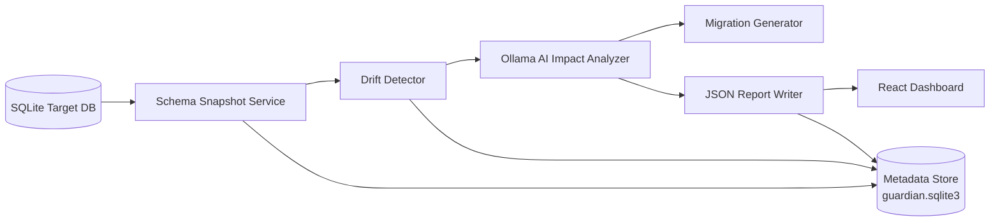

# Schema Evolution Guardian

# Schema Evolution Guardian

🎥 **Project Demo Video:**
https://github.com/NithinPranav-007/Infinite-solution-team-19/blob/main/team%2019%20video(output).mp4

**Schema Evolution Guardian** is an AI-powered schema drift detection and impact analysis platform for SQLite databases. It captures schema snapshots over time, compares versions, analyzes blast radius with Ollama (local LLM), and generates migration guidance through a React dashboard.


**Schema Evolution Guardian** is an AI-powered schema drift detection and impact analysis platform for SQLite databases. It captures schema snapshots over time, compares versions, analyzes blast radius with Ollama (local LLM), and generates migration guidance through a React dashboard.

---

## Table of Contents

1. [Overview](#overview)
2. [Features](#features)
3. [Architecture](#architecture)
4. [Project Structure](#project-structure)
5. [Setup & Run](#setup--run)
6. [Usage Guide](#usage-guide)
7. [Environment Variables](#environment-variables)
8. [Backend Services](#backend-services)
9. [Data Models Reference](#data-models-reference)
10. [API Reference](#api-reference)
11. [Frontend Reference](#frontend-reference)
12. [Agent Workflow](#agent-workflow)
13. [Testing](#testing)
14. [Limitations & Future Scope](#limitations--future-scope)

---

## Overview

### Problem

Teams ship database changes faster than downstream systems can absorb them. A dropped column, silent rename, or type change can break analytics pipelines, APIs, and BI dashboards.

### Solution

This tool:

1. **Snapshots** the current SQLite schema
2. **Compares** it to the previous snapshot
3. **Detects** structural drift (columns, tables, types)
4. **Analyzes** impact using Ollama AI (with heuristic fallback)
5. **Generates** SQL migration scripts and compatibility views
6. **Presents** everything in a web dashboard

### Tech Stack

| Layer | Technology |
|-------|------------|
| Backend | Python 3.11+, FastAPI, Uvicorn |
| AI | Ollama (local LLM, default: `llama3.2`) |
| Target DB | SQLite |
| Metadata store | SQLite (`guardian.sqlite3`) |
| Frontend | React 18, Vite 5, Tailwind CSS 3 |
| Testing | pytest |

---

## Features

| Feature | Description |
|---------|-------------|
| **Schema Snapshots** | Introspects SQLite schemas and stores versioned JSON snapshots |
| **Drift Detection** | Detects added/removed/renamed columns, type changes, and table changes |
| **AI Impact Analysis** | Ollama assesses business/technical impact; heuristic fallback if Ollama is offline |
| **Migration Generator** | Produces SQL scripts, compatibility views, and rollback guidance |
| **React Dashboard** | KPIs, drift table, schema diff, blast radius map, and analysis panel |
| **Database Preview** | Browse tables, columns, and sample rows |
| **History & Reports** | Timeline of drift events and archived scan reports |
| **Settings** | Configure the target SQLite database path |

---

## Architecture



**Data flow on scan:**

```
User clicks "Connect & Scan"
    → POST /scan
    → SchemaGuardianAgent.run()
        → Capture snapshot (JSON + DB record)
        → Compare with previous snapshot
        → If changes: AI analyze → generate migrations → save drift + report
        → If no changes: save "no changes" report only
    → Dashboard refreshes drifts, reports, latest schema
```

---

## Project Structure

```
Infinite solutions/
├── README.md
├── backend/
│   ├── app.py                      # FastAPI entry point, CORS, health check
│   ├── requirements.txt
│   ├── sample.db                   # Demo SQLite database (bootstrapped on startup)
│   ├── routes/
│   │   └── api.py                  # All HTTP endpoints
│   ├── services/
│   │   ├── models.py               # ColumnDefinition, TableDefinition, SnapshotDocument
│   │   ├── storage.py              # Metadata persistence, demo DB bootstrap
│   │   ├── schema_snapshot.py      # Schema introspection via PRAGMA
│   │   ├── drift_detector.py       # Snapshot diff engine
│   │   ├── ai_analyzer.py          # Ollama + heuristic fallback
│   │   ├── migration_generator.py  # SQL migration output
│   │   └── agent.py                # Orchestrates the full scan loop
│   └── tests/
│       ├── test_schema_snapshot.py
│       ├── test_drift_detector.py
│       ├── test_ai_analyzer.py
│       └── test_migration_generator.py
└── frontend/
    ├── package.json
    ├── vite.config.js
    ├── index.html
    └── src/
        ├── main.jsx                # React entry
        ├── App.jsx                 # Tab shell, data loading, scan orchestration
        ├── index.css               # Tailwind + custom styles
        ├── lib/
        │   └── api.js              # Backend HTTP client
        ├── pages/
        │   ├── Dashboard.jsx       # Main drift analysis view
        │   ├── DatabasePreview.jsx # Table browser
        │   ├── History.jsx         # Drift timeline
        │   ├── Reports.jsx         # Report archive
        │   └── Settings.jsx        # DB path configuration
        └── components/
            ├── KpiCard.jsx         # Metric cards
            ├── DriftTable.jsx      # Selectable drift event table
            ├── AnalysisPanel.jsx   # AI impact + migration output
            ├── SchemaDiff.jsx      # Visual change breakdown
            └── BlastRadiusMap.jsx  # Affected systems visualization
```

**Runtime-generated (gitignored):**

- `backend/guardian.sqlite3` — metadata store
- `backend/snapshots/*.json` — schema snapshot files
- `backend/reports/*.json` — scan report files
- `frontend/node_modules/`, `frontend/dist/`

---

## Setup & Run

### Prerequisites

- Python 3.11+
- Node.js 18+
- [Ollama](https://ollama.com/) (optional but recommended): `ollama pull llama3.2`

### Backend

```bash
cd backend
pip install -r requirements.txt
uvicorn app:app --reload --host 127.0.0.1 --port 8000
```

API available at **http://127.0.0.1:8000**  
Interactive docs at **http://127.0.0.1:8000/docs**

### Frontend

```bash
cd frontend
npm install
npm run dev
```

Open **http://localhost:5173**

Optional: create `frontend/.env`:

```
VITE_API_URL=http://127.0.0.1:8000
```

### Tests

```bash
cd backend
pytest -v
```

---

## Usage Guide

### First launch

1. Start backend and frontend (see above).
2. Open the dashboard — the app loads settings and fetches health, schema, drifts, and reports.
3. If no snapshot exists yet, a **baseline scan** runs automatically.
4. The header shows database connection status and the active database path.

### Detecting drift

1. Make a schema change to your SQLite database (outside the app — e.g. `ALTER TABLE`).
2. Click **Connect & Scan** in the header.
3. The agent captures a new snapshot, compares it to the previous one, and records any drift.
4. On the **Dashboard**, select a drift event in the table to view:
   - Risk gauge and severity
   - Blast radius map
   - Granular schema diff
   - AI impact analysis
   - Migration scripts and compatibility views

### Changing the monitored database

1. Go to **Settings**.
2. Enter the absolute path to your SQLite file (e.g. `D:\data\mydb.sqlite`).
3. Click **Save Settings**.
4. Click **Connect & Scan** to capture a new baseline.

### Browsing data

- **Database** tab — preview tables, columns, and sample rows.
- **History** tab — timeline of all drift events with AI summaries.
- **Reports** tab — full JSON output from every scan.

---

## Environment Variables

| Variable | Default | Used by | Description |
|----------|---------|---------|-------------|
| `OLLAMA_BASE_URL` | `http://localhost:11434` | `AIImpactAnalyzer` | Ollama API base URL |
| `OLLAMA_MODEL` | `llama3.2` | `AIImpactAnalyzer` | Model name for impact analysis |
| `VITE_API_URL` | `http://localhost:8000` | Frontend `api.js` | Backend URL for the React app |

---

## Backend Services

### `StorageService` (`storage.py`)

Manages all persistence:

- Creates `guardian.sqlite3` with tables: `drifts`, `reports`, `snapshots`, `settings`
- Writes snapshot JSON to `snapshots/` and reports to `reports/`
- Bootstraps `sample.db` with demo e-commerce data on startup
- Normalizes polluted demo schema (removes `meta_field_*` columns from prior testing)
- Settings API: `get_setting()` / `set_setting()`

### `SchemaSnapshotService` (`schema_snapshot.py`)

- Introspects SQLite via `sqlite_master`, `PRAGMA table_info`, `PRAGMA foreign_key_list`
- Builds a `SnapshotDocument` and saves JSON + DB record
- Schema version ID format: `schema_<unix_timestamp>`

### `DriftDetector` (`drift_detector.py`)

- Compares two snapshot documents table-by-table and column-by-column
- Rename detection: `SequenceMatcher` with ≥55% name similarity and matching data types
- Returns a list of change records; `summarize()` counts changes by type

### `AIImpactAnalyzer` (`ai_analyzer.py`)

- Sends previous/current schema + changes to Ollama `/api/chat` with JSON format
- 10-second timeout; falls back to `_heuristic_analysis()` on failure
- Heuristic scoring: removed table/column (+30), rename/type change (+20), added table (+10), added column (+5)
- Severity from score: Low (0–29), Medium (30–59), High (60–84), Critical (85–100)

### `MigrationGenerator` (`migration_generator.py`)

| Change type | Output |
|-------------|--------|
| `added_column` | `ALTER TABLE ... ADD COLUMN` |
| `renamed_column` | Compatibility view: `SELECT new_col AS old_col` |
| `removed_column` | Compatibility view with `NULL AS removed_col` |
| `data_type_changed` | Review comment |
| `added_table` / `removed_table` | Review / backup comments |

### `SchemaGuardianAgent` (`agent.py`)

Orchestrates the full scan loop (see [Agent Workflow](#agent-workflow)).

---

## Data Models Reference

### Python Dataclasses (`models.py`)

#### `ColumnDefinition`

| Field | Type | Description |
|-------|------|-------------|
| `name` | `str` | Column name |
| `data_type` | `str` | SQLite type (`INTEGER`, `TEXT`, `REAL`, etc.) |
| `not_null` | `bool` | NOT NULL constraint |
| `default_value` | `str \| None` | Default expression |
| `primary_key` | `bool` | Part of primary key |

#### `TableDefinition`

| Field | Type | Description |
|-------|------|-------------|
| `name` | `str` | Table name |
| `columns` | `list[ColumnDefinition]` | Column definitions |
| `constraints` | `dict` | `primary_key` list, `foreign_keys` list |

#### `SnapshotDocument`

| Field | Type | Description |
|-------|------|-------------|
| `schema_version` | `str` | e.g. `schema_1717776000` |
| `source_database` | `str` | Absolute path to source SQLite file |
| `captured_at` | `str` | ISO 8601 UTC timestamp |
| `tables` | `list[TableDefinition]` | All user tables at capture time |

Serialized JSON also includes `table_count`.

---

### Metadata Store (`guardian.sqlite3`)

#### `drifts`

| Column | Type | Description |
|--------|------|-------------|
| `id` | INTEGER PK | Auto-increment |
| `captured_at` | TEXT | Detection timestamp |
| `previous_snapshot` | TEXT | Previous schema version |
| `current_snapshot` | TEXT | Current schema version |
| `severity` | TEXT | Low / Medium / High / Critical |
| `risk_score` | INTEGER | 0–100 |
| `drift_payload` | TEXT (JSON) | Full drift record |

#### `reports`

| Column | Type | Description |
|--------|------|-------------|
| `id` | INTEGER PK | Auto-increment |
| `report_name` | TEXT UNIQUE | e.g. `report_2026_06_07_143022.json` |
| `created_at` | TEXT | ISO 8601 timestamp |
| `report_payload` | TEXT (JSON) | Full report document |

#### `snapshots`

| Column | Type | Description |
|--------|------|-------------|
| `id` | INTEGER PK | Auto-increment |
| `snapshot_name` | TEXT UNIQUE | e.g. `schema_1717776000.json` |
| `captured_at` | TEXT | ISO 8601 timestamp |
| `source_database` | TEXT | Path to source DB |
| `snapshot_payload` | TEXT (JSON) | Full snapshot document |

#### `settings`

| Column | Type | Description |
|--------|------|-------------|
| `key` | TEXT PK | Setting key |
| `value` | TEXT (JSON) | Setting value |

**Setting keys:**

| Key | Default | Description |
|-----|---------|-------------|
| `target_db_path` | `backend/sample.db` | SQLite database to monitor |

---

### Demo Database (`sample.db`)

| Table | Key columns |
|-------|-------------|
| `customers` | `id` PK, `customer_name`, `email` UNIQUE, `created_at` |
| `orders` | `id` PK, `customer_id` FK, `total_amount`, `status`, `created_at` |
| `order_items` | `id` PK, `order_id` FK, `sku`, `quantity`, `unit_price` |

Seeded with 3–5 customers, orders, and order items on first bootstrap.

---

### Drift Change Record

```json
{
  "table": "customers",
  "change": "renamed_column",
  "from": "email",
  "to": "email_address"
}
```

| Change type | Extra fields |
|-------------|--------------|
| `added_column` | `column` |
| `removed_column` | `column` |
| `renamed_column` | `from`, `to` |
| `data_type_changed` | `column`, `from`, `to` |
| `added_table` | _(table only)_ |
| `removed_table` | _(table only)_ |

---

### AI Analysis Output

```json
{
  "severity_score": "High",
  "severity_label": "High",
  "systems_potentially_affected": ["ETL pipelines", "BI dashboards"],
  "business_impact": "Data contracts may break for analytics consumers.",
  "technical_impact": "Column renames can fail queries or integrations.",
  "mitigation_plan": ["Create compatibility views", "Notify stakeholders"],
  "blast_radius": ["customers"],
  "risk_score": 70,
  "executive_summary": "Schema drift touched 1 table(s) and is assessed as High.",
  "recommended_actions": ["Generate migration script", "Validate compatibility views"],
  "ai_provider": "ollama"
}
```

`ai_provider` is `"heuristic-fallback"` when Ollama is unavailable.

---

### Migration Output

```json
{
  "sql_migration_script": "ALTER TABLE customers ADD COLUMN notes TEXT;",
  "compatibility_views": "CREATE VIEW IF NOT EXISTS customers_compatibility AS SELECT email_address AS email FROM customers;",
  "rollback_script": "-- Drop compatibility view for customers when migration is complete",
  "summary": { "severity": "High", "risk_score": 70 }
}
```

---

### Scan Report (`POST /scan` response)

```json
{
  "report_name": "report_2026_06_07_143022.json",
  "created_at": "2026-06-07T14:30:22+00:00",
  "drift_summary": { "total_changes": 1, "by_type": { "renamed_column": 1 } },
  "previous_snapshot": "schema_1717775900",
  "current_snapshot": "schema_1717776000",
  "snapshot_path": "backend/snapshots/schema_1717776000.json",
  "drift_changes": [],
  "impact_analysis": {},
  "suggested_fixes": {}
}
```

### Drift Record (stored in metadata DB)

```json
{
  "captured_at": "2026-06-07T14:30:22+00:00",
  "previous_snapshot": "schema_1717775900",
  "current_snapshot": "schema_1717776000",
  "severity": "High",
  "risk_score": 70,
  "changes": [],
  "analysis": {},
  "mitigation": {}
}
```

Drift records are saved only when actual schema changes are detected.

---

## API Reference

Base URL: `http://localhost:8000`

### `GET /health`

Returns service status and configured database path.

```json
{
  "status": "ok",
  "service": "Schema Evolution Guardian",
  "database": "D:\\Infinite solutions\\backend\\sample.db"
}
```

### `GET /schema/latest`

Returns the most recent schema snapshot. **404** if none exists.

### `GET /drifts`

Returns all recorded drift events (newest first).

### `POST /scan`

Runs the full agent loop.

**Request body (optional):**

```json
{ "db_path": "D:\\path\\to\\database.sqlite" }
```

Omit `db_path` to use the configured setting or default `sample.db`.

### `POST /analyze`

Analyzes supplied schemas without running a scan.

**Request body:**

```json
{
  "previous_schema": { "tables": [] },
  "current_schema": { "tables": [] },
  "changes": [{ "table": "customers", "change": "added_column", "column": "notes" }]
}
```

### `GET /reports`

Returns all generated scan reports (newest first).

### `GET /database/preview`

Preview tables, columns, and sample rows.

**Query parameters:**

| Param | Type | Default | Description |
|-------|------|---------|-------------|
| `db_path` | string | from settings | Path to SQLite file |
| `table` | string | all | Filter to one table |
| `limit` | int | 5 | Sample rows per table |

### `GET /settings`

```json
{ "target_db_path": "D:\\Infinite solutions\\backend\\sample.db" }
```

### `POST /settings`

**Request body:**

```json
{ "target_db_path": "D:\\path\\to\\mydb.sqlite" }
```

**Response:**

```json
{ "status": "success", "message": "Settings updated successfully" }
```

---

## Frontend Reference

### Pages

| Tab | File | What it shows |
|-----|------|---------------|
| **Dashboard** | `Dashboard.jsx` | KPIs, drift table, risk gauge, blast radius, schema diff, AI analysis, migrations |
| **Database** | `DatabasePreview.jsx` | Table list, column names, sample rows |
| **History** | `History.jsx` | Chronological drift events with AI summaries |
| **Reports** | `Reports.jsx` | All scan reports with expandable JSON |
| **Settings** | `Settings.jsx` | Target database path configuration |

### Components

| Component | Purpose |
|-----------|---------|
| `KpiCard` | Metric display (tables, drifts, critical count, avg risk) |
| `DriftTable` | Clickable table of drift events with severity badges |
| `SchemaDiff` | Visual breakdown of each structural change |
| `BlastRadiusMap` | Shows affected systems/tables for selected drift |
| `AnalysisPanel` | AI impact assessment + migration script display |

### API client (`lib/api.js`)

| Function | Endpoint |
|----------|----------|
| `fetchHealth()` | `GET /health` |
| `fetchLatestSchema()` | `GET /schema/latest` |
| `fetchDrifts()` | `GET /drifts` |
| `fetchReports()` | `GET /reports` |
| `triggerScanWithPath(dbPath)` | `POST /scan` |
| `fetchDatabasePreview(dbPath, table)` | `GET /database/preview` |
| `fetchSettings()` | `GET /settings` |
| `saveSettings(settings)` | `POST /settings` |

---

## Agent Workflow

`SchemaGuardianAgent.run()` executes these steps:

```
1. CAPTURE
   SchemaSnapshotService.capture(db_path)
   → Writes snapshots/schema_<timestamp>.json
   → Saves record in guardian.sqlite3

2. BASELINE CHECK
   If no previous snapshot exists:
   → Save baseline report, return

3. COMPARE
   DriftDetector.compare(previous, current)
   → List of change records

4. NO CHANGES
   If changes list is empty:
   → Save "no changes" report, return (no drift record)

5. ANALYZE
   AIImpactAnalyzer.analyze(previous, current, changes)
   → Ollama JSON response OR heuristic fallback

6. GENERATE
   MigrationGenerator.generate(changes, analysis)
   → SQL scripts, compatibility views, rollback comments

7. PERSIST
   → Save drift record to guardian.sqlite3
   → Save report JSON to reports/
   → Return full report to caller
```

---

## Testing

```bash
cd backend
pytest -v
```

| Test file | What it covers |
|-----------|----------------|
| `test_schema_snapshot.py` | Snapshot capture from SQLite |
| `test_drift_detector.py` | Rename and table change detection |
| `test_ai_analyzer.py` | Ollama response normalization (mocked) |
| `test_migration_generator.py` | Compatibility view SQL for renames |

---

## Limitations & Future Scope

### Current limitations

- **SQLite only** — no PostgreSQL or MySQL support yet
- **Heuristic rename detection** — requires ≥55% column name similarity; unrelated renames appear as remove + add
- **AI quality** — depends on the local Ollama model and prompt
- **Compatibility views** — generated as suggestions; require manual review before production use
- **Single-user** — no authentication or multi-tenant support

### Future scope

- PostgreSQL and MySQL schema introspection
- Scheduled / automated scans
- Richer dependency graphs (table → consumer mapping)
- Alert routing (Slack, email, PagerDuty)
- Report trend analytics over time
- CI/CD integration (scan on deploy)
