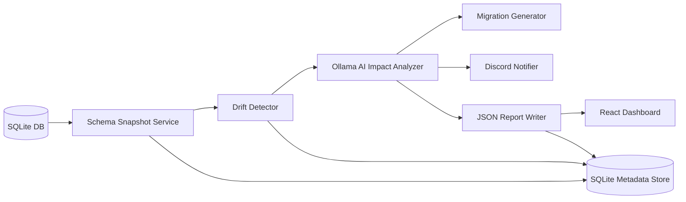

# Schema Evolution Guardian

Schema Evolution Guardian is an AI-powered schema drift detection and impact analysis platform for relational databases. It captures SQLite schema snapshots, compares versions, asks Ollama to analyze the impact, generates mitigation guidance, and notifies teams through Discord webhooks.

## Problem Statement

Teams ship database changes faster than downstream systems can absorb them. A dropped column or silent type change can break analytics, APIs, and pipelines. This project detects drift early, quantifies blast radius, and suggests remediation before production incidents occur.

## Architecture Diagram



## Setup Instructions

### Backend

1. Create a Python 3.11 environment.
2. Install dependencies from `backend/requirements.txt`.
3. Start Ollama locally and pull a model such as `llama3.2` or `mistral`.

### Frontend

1. Install Node.js 18+.
2. Run `npm install` inside `frontend/`.

## Run Instructions

### Backend

```bash
cd backend
uvicorn app:app --reload --host 0.0.0.0 --port 8000
```

### Frontend

```bash
cd frontend
npm run dev
```

## API Documentation

### `GET /health`

Returns service status.

### `GET /schema/latest`

Returns the most recent schema snapshot record.

### `GET /drifts`

Returns recorded drift events.

### `POST /scan`

Runs the full agent loop. Optional payload:

```json
{ "db_path": "path/to/sqlite.db" }
```

### `POST /analyze`

Analyzes supplied snapshots and changes.

### `GET /reports`

Lists generated JSON reports.

### `POST /notify`

Sends a Discord notification payload.

## Screenshots Placeholder

Add dashboard screenshots here after running the frontend.

## Assumptions

The production demo uses SQLite as the schema source and metadata store. Ollama is available on the local machine or network and the Discord webhook is optionally configured through environment variables.

## Limitations

SQLite rename detection is heuristic-based. The AI layer is only as reliable as the local Ollama model and prompt quality. Compatibility views are generated as suggestions and may need manual review.

## Future Scope

Support PostgreSQL and MySQL introspection, add scheduled scans, create richer dependency graphs, publish alert routing integrations, and surface report trends in the dashboard.
